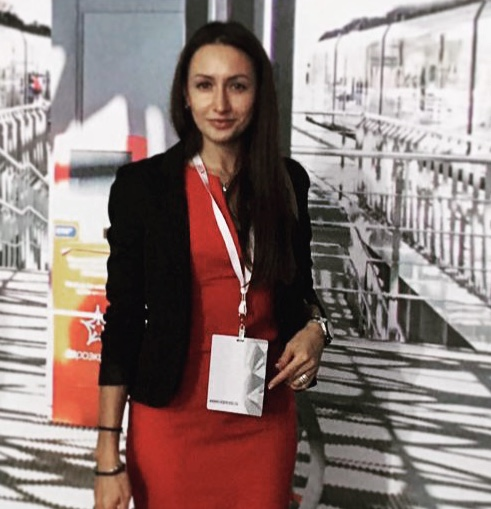

# Кусакина Мария

-------------
На сегодняшний день я являюсь студентом Нетология, а вообще я - экномист.
Всегда нравился активный образ жизни. Занимаюсь любительским триатлоном.
Никогда не думала, что в возрасте почти 40 лет решу изучить что-то абсолютное новое и, как оказалось, сложное и 
интересное для меня,что в дальнейшем сможет стать моей новой профессией. Очень отстаю в учебе, но уверена, что справлюсь.

----------
### На сегодняшний день, помимо основных профессиональных навыков экономиста, я могу:

* писать небольшие коды на языке Java;
* работать с СКВ- Git

